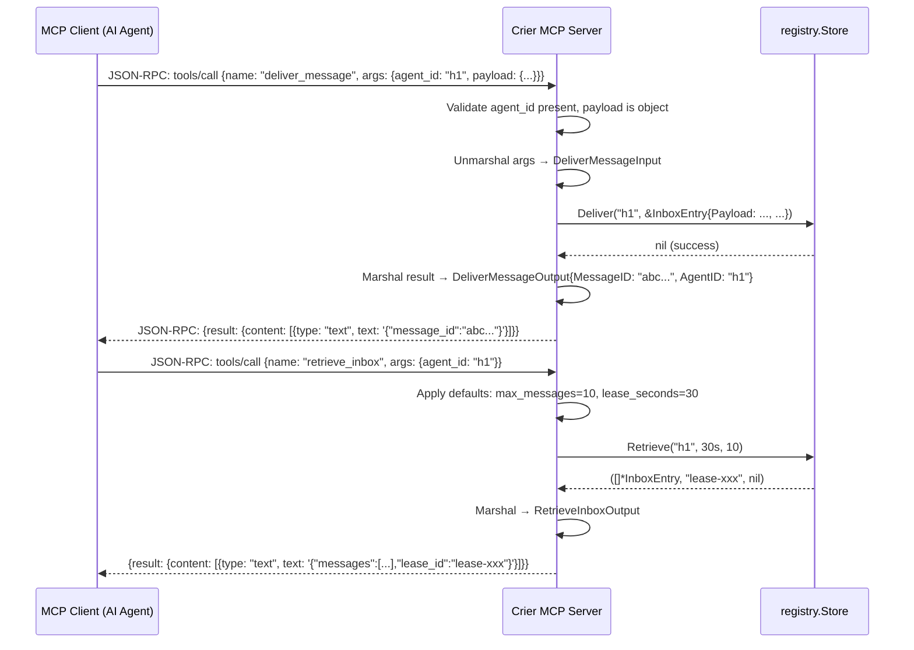

# CI-007: MCP Server — Axiom-Level Implementation Spec

**Version:** 1.0.0  
**Date:** 2026-07-16  
**Status:** Ready for implementation  
**Depends on:** CI-003 (Registry + Inboxes), CI-003b (PostgreSQL persistence)

---

## 1. Overview

The Crier MCP server exposes the agent registry and inbox operations as **Model Context Protocol (MCP)** tools, enabling AI agents to discover peers, deliver messages, and manage inboxes through the standard MCP tool-calling interface.

**MCP version:** 2024-11-05 (protocol version `"2024-11-05"`)  
**Transport:** **stdio** (standard I/O transport). The MCP server reads JSON-RPC from stdin and writes to stdout. This is the simplest, most portable transport — no port allocation, no CORS, no TLS. The MCP client (e.g., Claude Desktop, Hermes, any MCP host) spawns the binary as a subprocess.

**Design principle:** The MCP server is a **thin wrapper** around `registry.Store`. It contains zero business logic — every tool call is a 1:1 delegation to a Store method. The Store interface is already tested, already handles concurrency, and already has both in-memory and PostgreSQL backends.

---

## 2. Architecture

```
┌──────────────┐     stdio (JSON-RPC)     ┌─────────────────┐     Go interface     ┌──────────────┐
│  MCP Client   │ ◄──────────────────────► │  Crier MCP Server │ ◄──────────────────► │ registry.Store│
│  (AI Agent)   │                          │  cmd/crier-mcp    │                      │ (memory or PG)│
└──────────────┘                          └─────────────────┘                      └──────────────┘
```

### 2.1 Binary Layout

```
cmd/crier-mcp/main.go          # Entrypoint: config load, store init, MCP server start
internal/mcp/                   # MCP package (net-new)
├── server.go                   # MCPServer struct, Serve() stdio loop, tool registry
├── tools.go                    # Tool handler functions (one per Store method)
├── types.go                    # MCP-specific types (Tool, ToolResult, JSON Schema wrappers)
└── server_test.go              # Tests against mock Store
```

### 2.2 Package Dependencies

- `github.com/totalwindupflightsystems/crier/internal/registry` — Store interface, types
- `github.com/totalwindupflightsystems/crier/config` — Config loading (reuse existing)
- Standard library only for JSON-RPC and stdio (no external MCP library)

### 2.3 No External MCP Library

Crier's MCP server uses **only the Go standard library**. The MCP protocol over stdio is a simple JSON-RPC 2.0 framing:
- Each message is a JSON object followed by a newline
- The server reads lines from stdin, dispatches to tool handlers, writes responses to stdout
- No HTTP, no WebSocket, no gRPC — just `bufio.Scanner` + `json.Encoder`

This avoids dependency bloat and ensures the binary stays small. The full MCP lifecycle (`initialize`, `tools/list`, `tools/call`, `shutdown`) is ~200 lines of JSON-RPC dispatch.

---

## 3. Dependencies

### 3.1 Go Module Imports

```go
import (
    "bufio"
    "context"
    "encoding/json"
    "fmt"
    "io"
    "log"
    "os"
    "os/signal"
    "syscall"

    "github.com/totalwindupflightsystems/crier/config"
    "github.com/totalwindupflightsystems/crier/internal/registry"
)
```

### 3.2 External Dependencies

**None beyond existing.** The MCP server reuses:
- `config.Config` — reads `CR_DATABASE_URL` / `CRIER_PORT` / pool settings
- `registry.Store` — already implemented (MemoryStore, PostgresStore)
- `registry.Agent`, `registry.InboxEntry`, `registry.HexKey` — existing types

No new entries in `go.mod`.

---

## 4. Tool Definitions

All tools follow the MCP `tools/call` protocol. Input validation happens in the tool handler before delegating to the Store. Errors are returned as MCP error responses with structured messages.

### 4.1 Tool: `register_agent`

**Description:** Register a new agent with an ed25519 public key and optional capabilities.

**Input Schema:**
```json
{
  "type": "object",
  "properties": {
    "id": {
      "type": "string",
      "description": "Unique agent identifier (e.g., 'hermes-1', 'scheduler-prod')"
    },
    "public_key": {
      "type": "string",
      "description": "Hex-encoded ed25519 public key (64 hex characters)",
      "pattern": "^[0-9a-fA-F]{64}$"
    },
    "capabilities": {
      "type": "array",
      "items": { "type": "string" },
      "description": "Capability tags (e.g., ['coding', 'deploy', 'monitor'])",
      "default": []
    }
  },
  "required": ["id", "public_key"]
}
```

**Output:** The created Agent object as JSON, or an MCP error.

**Success Response:**
```json
{
  "id": "hermes-1",
  "public_key": "3b6a27bcceb6a42d62a3a8d02a6f0d73653215771de243a63ac048a18b59da29",
  "capabilities": ["coding", "deploy"],
  "status": "online",
  "registered_at": "2026-07-16T12:00:00Z",
  "last_seen": "2026-07-16T12:00:00Z"
}
```

**Error Cases:**
| Condition | MCP Error |
|-----------|-----------|
| `id` missing or empty | `-32602 Invalid params: id is required` |
| `public_key` missing or empty | `-32602 Invalid params: public_key is required` |
| `public_key` not 64 hex chars | `-32602 Invalid params: public_key must be 64 hex characters (ed25519)` |
| `public_key` not valid ed25519 | `-32602 Invalid params: invalid ed25519 public key` |
| Agent already exists | `-32602 Invalid params: agent already registered` |

### 4.2 Tool: `list_agents`

**Description:** List all registered agents with their status and capabilities.

**Input Schema:**
```json
{
  "type": "object",
  "properties": {},
  "required": []
}
```

**Output:**
```json
{
  "agents": [
    {
      "id": "hermes-1",
      "public_key": "3b6a...",
      "capabilities": ["coding", "deploy"],
      "status": "online",
      "registered_at": "2026-07-16T12:00:00Z",
      "last_seen": "2026-07-16T12:00:00Z"
    }
  ]
}
```

### 4.3 Tool: `get_agent`

**Description:** Get detailed information about a specific agent.

**Input Schema:**
```json
{
  "type": "object",
  "properties": {
    "id": {
      "type": "string",
      "description": "Agent identifier"
    }
  },
  "required": ["id"]
}
```

**Output:** Single Agent object (see register_agent output).

**Error Cases:**
| Condition | MCP Error |
|-----------|-----------|
| Agent not found | `-32602 Invalid params: agent not found` |

### 4.4 Tool: `unregister_agent`

**Description:** Remove an agent and clean up its inbox.

**Input Schema:**
```json
{
  "type": "object",
  "properties": {
    "id": {
      "type": "string",
      "description": "Agent identifier to remove"
    }
  },
  "required": ["id"]
}
```

**Output:**
```json
{
  "unregistered": "hermes-1"
}
```

**Error Cases:**
| Condition | MCP Error |
|-----------|-----------|
| Agent not found | `-32602 Invalid params: agent not found` |

### 4.5 Tool: `deliver_message`

**Description:** Deliver a message to an agent's persistent inbox.

**Input Schema:**
```json
{
  "type": "object",
  "properties": {
    "agent_id": {
      "type": "string",
      "description": "Target agent identifier"
    },
    "payload": {
      "type": "object",
      "description": "Message payload (arbitrary JSON)"
    }
  },
  "required": ["agent_id", "payload"]
}
```

**Output:**
```json
{
  "message_id": "a1b2c3d4e5f6a7b8c9d0e1f2",
  "agent_id": "hermes-1"
}
```

**Error Cases:**
| Condition | MCP Error |
|-----------|-----------|
| Agent not found | `-32602 Invalid params: agent not found` |
| `payload` missing or not an object | `-32602 Invalid params: payload must be a JSON object` |

### 4.6 Tool: `retrieve_inbox`

**Description:** Retrieve leased messages from an agent's inbox. Messages are leased for the specified duration — they must be ACKed before the lease expires, or they return to the queue.

**Input Schema:**
```json
{
  "type": "object",
  "properties": {
    "agent_id": {
      "type": "string",
      "description": "Agent identifier"
    },
    "max_messages": {
      "type": "integer",
      "description": "Maximum messages to retrieve (1-100)",
      "default": 10,
      "minimum": 1,
      "maximum": 100
    },
    "lease_seconds": {
      "type": "integer",
      "description": "Lease duration in seconds",
      "default": 30,
      "minimum": 1,
      "maximum": 3600
    }
  },
  "required": ["agent_id"]
}
```

**Output:**
```json
{
  "messages": [
    {
      "id": "a1b2c3d4e5f6a7b8c9d0e1f2",
      "agent_id": "hermes-1",
      "payload": {"type": "task", "body": "build scheduler"},
      "created_at": "2026-07-16T12:00:00Z",
      "expires_at": "2026-07-17T12:00:00Z",
      "leased_at": "2026-07-16T12:05:00Z",
      "lease_id": "fedcba0987654321fedcba0987654321",
      "acked": false
    }
  ],
  "lease_id": "fedcba0987654321fedcba0987654321"
}
```

**Error Cases:**
| Condition | MCP Error |
|-----------|-----------|
| Agent not found | `-32602 Invalid params: agent not found` |
| `max_messages` > 100 | `-32602 Invalid params: max_messages must be <= 100` |
| `lease_seconds` > 3600 | `-32602 Invalid params: lease_seconds must be <= 3600` |

### 4.7 Tool: `ack_messages`

**Description:** Acknowledge (confirm delivery of) previously retrieved messages. ACKed messages are permanently removed from the inbox.

**Input Schema:**
```json
{
  "type": "object",
  "properties": {
    "agent_id": {
      "type": "string",
      "description": "Agent identifier"
    },
    "lease_id": {
      "type": "string",
      "description": "Lease ID from the retrieve_inbox response"
    },
    "message_ids": {
      "type": "array",
      "items": { "type": "string" },
      "description": "Message IDs to acknowledge",
      "minItems": 1
    }
  },
  "required": ["agent_id", "lease_id", "message_ids"]
}
```

**Output:**
```json
{
  "acked": 3
}
```

**Error Cases:**
| Condition | MCP Error |
|-----------|-----------|
| Agent not found | `-32602 Invalid params: agent not found` |
| `lease_id` missing | `-32602 Invalid params: lease_id is required` |
| `message_ids` empty | `-32602 Invalid params: message_ids must not be empty` |
| Lease conflict (wrong lease) | `-32602 Invalid params: message is not leased under the supplied lease` |

### 4.8 Tool: `inbox_stats`

**Description:** Get inbox statistics for an agent — queue depth, leased count, and oldest message age.

**Input Schema:**
```json
{
  "type": "object",
  "properties": {
    "agent_id": {
      "type": "string",
      "description": "Agent identifier"
    }
  },
  "required": ["agent_id"]
}
```

**Output:**
```json
{
  "queue_depth": 42,
  "leased_count": 5,
  "oldest_age_ms": 3600000
}
```

**Error Cases:**
| Condition | MCP Error |
|-----------|-----------|
| Agent not found | `-32602 Invalid params: agent not found` |

---

## 5. Behavior

### 5.1 JSON-RPC Lifecycle

```
1. Client spawns: crier-mcp
2. Client sends: {"jsonrpc":"2.0","method":"initialize","params":{"protocolVersion":"2024-11-05",...},"id":1}
3. Server responds: {"jsonrpc":"2.0","result":{"protocolVersion":"2024-11-05","serverInfo":{"name":"crier-mcp","version":"0.1.0"},"capabilities":{"tools":{}}},"id":1}
4. Client sends: {"jsonrpc":"2.0","method":"notifications/initialized","params":{}}
5. Client sends: {"jsonrpc":"2.0","method":"tools/list","params":{},"id":2}
6. Server responds: {"jsonrpc":"2.0","result":{"tools":[...8 tool definitions...]},"id":2}
7. Client sends: {"jsonrpc":"2.0","method":"tools/call","params":{"name":"register_agent","arguments":{...}},"id":3}
8. Server responds: {"jsonrpc":"2.0","result":{"content":[{"type":"text","text":"<JSON>"}]},"id":3}
```

### 5.2 Input Validation Order

For each tool call, validation runs in this order:
1. Parse JSON-RPC envelope (method, params, id)
2. Validate `params.name` matches a registered tool
3. Unmarshal `params.arguments` into tool-specific input struct
4. Validate required fields present
5. Validate field formats (hex key length, integer ranges)
6. Delegate to `registry.Store` method
7. Marshal Store result into tool-specific output struct
8. Wrap in MCP `content: [{type: "text", text: "<JSON>"}]`

### 5.3 Error Mapping

```go
func mcpError(err error) (code int, message string) {
    switch {
    case errors.Is(err, registry.ErrAgentNotFound):
        return -32602, "agent not found"
    case errors.Is(err, registry.ErrAgentExists):
        return -32602, "agent already registered"
    case errors.Is(err, registry.ErrLeaseConflict):
        return -32602, "message is not leased under the supplied lease"
    case errors.Is(err, registry.ErrInvalidStoreInput):
        return -32602, err.Error()
    default:
        log.Printf("store error: %v", err)
        return -32603, "registry storage unavailable"
    }
}
```

### 5.4 Store Backend Selection

The MCP server initializes a Store the same way `cmd/server/main.go` does:

```go
func initStore(cfg config.Config) (registry.Store, func(), error) {
    if cfg.Database.URL != "" {
        ctx, cancel := context.WithTimeout(context.Background(), cfg.Database.ConnectTimeout)
        defer cancel()
        pgStore, err := registry.NewPostgresStoreWithPoolConfig(ctx, cfg.Database.URL, registry.PoolConfig{
            MaxConns:        cfg.Database.MaxConns,
            MinConns:        cfg.Database.MinConns,
            MaxConnLifetime: cfg.Database.MaxConnLifetime,
            MaxConnIdleTime: cfg.Database.MaxConnIdleTime,
        })
        if err != nil {
            return nil, nil, fmt.Errorf("postgres: %w", err)
        }
        return pgStore, func() { pgStore.Close() }, nil
    }
    return registry.NewMemoryStore(), func() {}, nil
}
```

### 5.5 Shutdown

- Graceful shutdown on SIGINT/SIGTERM
- Close the Store (if it implements `Close()`) 
- Drain any in-flight tool calls (context cancellation)
- Flush stdout and exit 0

---

## 6. Data

### 6.1 MCP Tool Result Format

Every successful tool call returns:
```json
{
  "content": [
    {
      "type": "text",
      "text": "<JSON-encoded tool output>"
    }
  ],
  "isError": false
}
```

Error tool calls return:
```json
{
  "content": [
    {
      "type": "text",
      "text": "<error message>"
    }
  ],
  "isError": true
}
```

### 6.2 Tool Input Go Types

```go
// internal/mcp/types.go

type RegisterAgentInput struct {
    ID           string   `json:"id"`
    PublicKey    string   `json:"public_key"`
    Capabilities []string `json:"capabilities,omitempty"`
}

type GetAgentInput struct {
    ID string `json:"id"`
}

type UnregisterAgentInput struct {
    ID string `json:"id"`
}

type DeliverMessageInput struct {
    AgentID string          `json:"agent_id"`
    Payload json.RawMessage `json:"payload"`
}

type RetrieveInboxInput struct {
    AgentID      string `json:"agent_id"`
    MaxMessages  int    `json:"max_messages,omitempty"`
    LeaseSeconds int    `json:"lease_seconds,omitempty"`
}

type AckMessagesInput struct {
    AgentID    string   `json:"agent_id"`
    LeaseID    string   `json:"lease_id"`
    MessageIDs []string `json:"message_ids"`
}

type InboxStatsInput struct {
    AgentID string `json:"agent_id"`
}
```

### 6.3 Tool Output Go Types

```go
type DeliverMessageOutput struct {
    MessageID string `json:"message_id"`
    AgentID   string `json:"agent_id"`
}

type RetrieveInboxOutput struct {
    Messages []*registry.InboxEntry `json:"messages"`
    LeaseID  string                 `json:"lease_id"`
}

type AckMessagesOutput struct {
    Acked int `json:"acked"`
}

type InboxStatsOutput struct {
    QueueDepth  int   `json:"queue_depth"`
    LeasedCount int   `json:"leased_count"`
    OldestAgeMs int64 `json:"oldest_age_ms"`
}

type UnregisterAgentOutput struct {
    Unregistered string `json:"unregistered"`
}

type ListAgentsOutput struct {
    Agents []*registry.Agent `json:"agents"`
}
```

---

## 7. States

### 7.1 Server States

```
[UNINITIALIZED] ──Load config──► [CONFIGURED] ──Init store──► [READY]
                                                                     │
                                                        ┌────────────┘
                                                        ▼
                                                  [RUNNING] ──SIGINT/SIGTERM──► [SHUTTING DOWN] ──store.Close()──► [STOPPED]
```

**State transitions:**
| State | Description |
|-------|-------------|
| UNINITIALIZED | Binary started, no config loaded |
| CONFIGURED | Config loaded from env, Store not yet initialized |
| READY | Store initialized, not yet accepting connections |
| RUNNING | Accepting JSON-RPC on stdio |
| SHUTTING DOWN | Draining in-flight calls, closing Store |
| STOPPED | Process exiting |

### 7.2 Store Backend States

| Backend | When Used | State |
|---------|-----------|-------|
| MemoryStore | `CR_DATABASE_URL` not set | Ephemeral — data lost on restart |
| PostgresStore | `CR_DATABASE_URL` set | Durable — data persisted across restarts |

---

## 8. Error Catalog

| Error Code | MCP Code | Message | Trigger |
|-----------|----------|---------|---------|
| `ERR_AGENT_NOT_FOUND` | -32602 | `agent not found` | GetAgent, UnregisterAgent, DeliverMessage, RetrieveInbox, AckMessages, InboxStats with unknown ID |
| `ERR_AGENT_EXISTS` | -32602 | `agent already registered` | RegisterAgent with duplicate ID |
| `ERR_LEASE_CONFLICT` | -32602 | `message is not leased under the supplied lease` | AckMessages with wrong lease ID |
| `ERR_INVALID_INPUT` | -32602 | (dynamic — describes what's invalid) | Missing required fields, invalid hex key, out-of-range values |
| `ERR_STORE_UNAVAILABLE` | -32603 | `registry storage unavailable` | PostgreSQL connection lost, disk full, any unexpected Store error |
| `ERR_INVALID_JSON` | -32700 | `parse error` | Malformed JSON-RPC message on stdin |
| `ERR_METHOD_NOT_FOUND` | -32601 | `method not found` | Unknown JSON-RPC method |
| `ERR_TOOL_NOT_FOUND` | -32602 | `unknown tool: <name>` | tools/call with unrecognized tool name |
| `ERR_INVALID_ARGS` | -32602 | `invalid arguments: <detail>` | tools/call arguments don't match tool schema |

---

## 9. Testing

### 9.1 Test Strategy

All tests use `registry.NewMemoryStore()` — no PostgreSQL dependency in unit tests. Tests live in `internal/mcp/server_test.go`.

### 9.2 Test Scenarios

**register_agent:**
1. Register valid agent → 201, verify agent returned with correct fields
2. Duplicate registration → error "agent already registered"
3. Invalid hex key (wrong length) → error "must be 64 hex characters"

**list_agents:**
1. Empty registry → returns `{"agents":[]}`
2. Two registered agents → returns both

**get_agent:**
1. Existing agent → returns full agent object
2. Non-existent agent → error "agent not found"

**unregister_agent:**
1. Unregister existing agent → success, subsequent GetAgent returns not-found
2. Unregister non-existent → error "agent not found"

**deliver_message:**
1. Deliver to existing agent → returns message_id
2. Deliver to non-existent agent → error "agent not found"
3. Empty payload object `{}` → accepted

**retrieve_inbox:**
1. Empty inbox → returns `{"messages":[], "lease_id":"..."}` 
2. One message delivered → retrieve returns it with lease
3. Default max_messages=10 → test with 15 messages, verify only 10 returned
4. Lease duration test → retrieve, wait > lease, verify un-ACKed messages return to queue

**ack_messages:**
1. ACK one message → message permanently removed, subsequent retrieve shows 0
2. ACK with wrong lease → error "message is not leased under the supplied lease"
3. ACK empty message_ids array → error "message_ids must not be empty"

**inbox_stats:**
1. Empty inbox → queue_depth=0, leased_count=0
2. Delivered 5, retrieved 3 → queue_depth=2, leased_count=3 (un-ACKed)
3. Non-existent agent → error "agent not found"

**Concurrent:**
1. Two parallel retrievers get disjoint message sets (lease prevents double-delivery)

**Server lifecycle:**
1. `initialize` → returns server info with correct name/version
2. `tools/list` → returns all 8 tools with correct schemas
3. Unknown method → error "-32601 method not found"
4. Malformed JSON → error "-32700 parse error"

### 9.3 Test Count Estimate

- ~15-20 test functions covering all scenarios above
- Target: >85% coverage on `internal/mcp/`

---

## 10. Performance

### 10.1 Latency Budget

| Operation | P50 | P99 | Notes |
|-----------|-----|-----|-------|
| Tool call (memory store) | <1ms | <5ms | In-memory map operations |
| Tool call (PostgreSQL) | <5ms | <20ms | Single-row queries with indexes |
| Server startup | <100ms | <500ms | Config load + Store init |
| Shutdown | <50ms | <200ms | Store close + stdout flush |

### 10.2 Concurrency

- The MCP server processes requests **serially** on stdin (stdio is a single stream)
- The Store interface is already concurrency-safe (sync.RWMutex or pgxpool)
- No goroutine-per-request model — keep it simple, single-goroutine stdio loop

### 10.3 Binary Size

- Target: <15MB (Go binary with only stdlib + existing Crier deps)
- No new external dependencies

---

## Appendix A: Mermaid Data Flow



## Appendix B: Complete Tool Handler Pseudocode

```go
// internal/mcp/tools.go

func (s *MCPServer) handleRegisterAgent(args json.RawMessage) (any, error) {
    var in RegisterAgentInput
    if err := json.Unmarshal(args, &in); err != nil {
        return nil, fmt.Errorf("invalid arguments: %w", err)
    }
    if in.ID == "" {
        return nil, fmt.Errorf("id is required")
    }
    if in.PublicKey == "" {
        return nil, fmt.Errorf("public_key is required")
    }
    rawKey, err := hex.DecodeString(in.PublicKey)
    if err != nil || len(rawKey) != ed25519.PublicKeySize {
        return nil, fmt.Errorf("public_key must be 64 hex characters (ed25519)")
    }
    agent := &registry.Agent{
        ID:           in.ID,
        PublicKey:    registry.HexKey(rawKey),
        Capabilities: in.Capabilities,
    }
    if agent.Capabilities == nil {
        agent.Capabilities = []string{}
    }
    if err := s.store.Register(agent); err != nil {
        return nil, err
    }
    return agent, nil
}

func (s *MCPServer) handleRetrieveInbox(args json.RawMessage) (any, error) {
    var in RetrieveInboxInput
    if err := json.Unmarshal(args, &in); err != nil {
        return nil, fmt.Errorf("invalid arguments: %w", err)
    }
    if in.MaxMessages == 0 {
        in.MaxMessages = 10
    }
    if in.MaxMessages > 100 {
        return nil, fmt.Errorf("max_messages must be <= 100")
    }
    if in.LeaseSeconds == 0 {
        in.LeaseSeconds = 30
    }
    if in.LeaseSeconds > 3600 {
        return nil, fmt.Errorf("lease_seconds must be <= 3600")
    }
    msgs, leaseID, err := s.store.Retrieve(in.AgentID, time.Duration(in.LeaseSeconds)*time.Second, in.MaxMessages)
    if err != nil {
        return nil, err
    }
    if msgs == nil {
        msgs = []*registry.InboxEntry{}
    }
    return RetrieveInboxOutput{Messages: msgs, LeaseID: leaseID}, nil
}
```

## Appendix C: File Inventory

**New files (4):**
| File | Lines (est.) | Purpose |
|------|-------------|---------|
| `cmd/crier-mcp/main.go` | ~80 | Entrypoint: config load, store init, MCP server start |
| `internal/mcp/server.go` | ~150 | MCPServer struct, stdio JSON-RPC loop, initialize/tools_list/tools_call dispatch |
| `internal/mcp/tools.go` | ~300 | 8 tool handler functions + input validation |
| `internal/mcp/types.go` | ~80 | Input/output structs for all 8 tools |
| `internal/mcp/server_test.go` | ~400 | 15-20 test functions against MemoryStore |

**Total new code:** ~1,010 lines (4 source files + 1 test file)

**No existing files modified.** The MCP server is additive — it imports existing packages but doesn't modify them.
